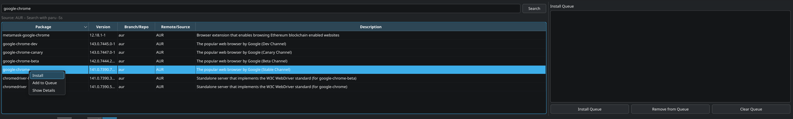
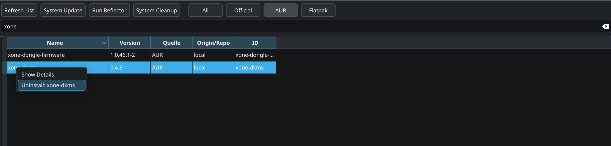
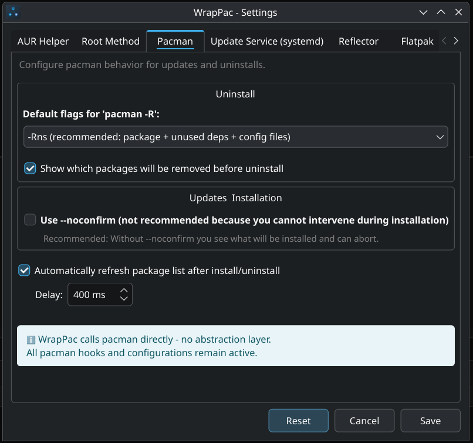
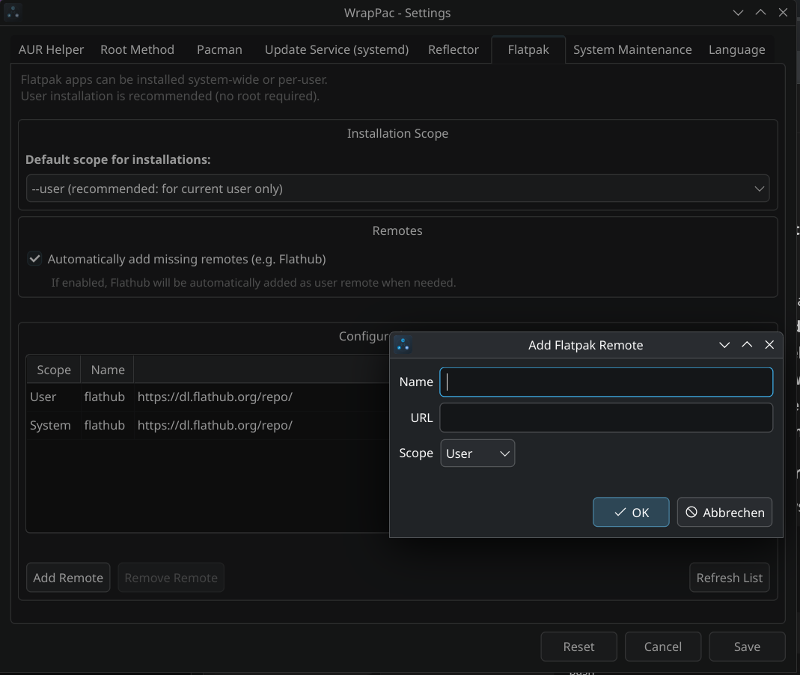
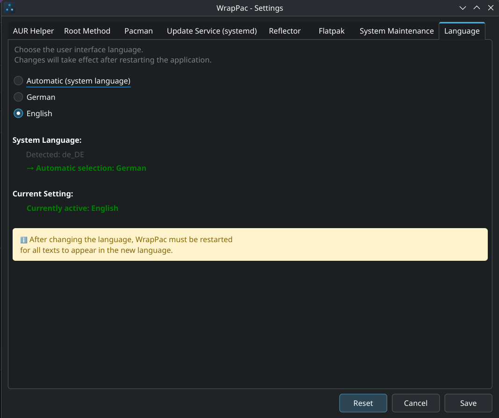
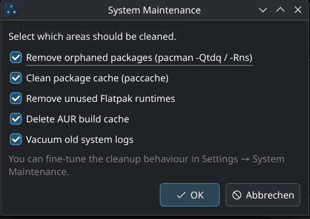

# WrapPac

<p align="center">
  
</p>

> ⚠️ **Disclaimer:**  
> This software is **experimental** and provided **as is**.  
> Use at your own risk — I take **no responsibility** for any damage, data loss, or system issues resulting from its use.

**WrapPac** is a lightweight desktop companion for **Arch Linux** users who mix packages from the official repositories, the AUR, and Flatpak.
It unifies all installed packages into a single overview and provides convenient tools to inspect, update, or remove them — without relying on internal pacman libraries or background root daemons.

---

## 💡 Motivation

**WrapPac** was built for users who want a graphical interface that behaves *exactly like the terminal* — using the same commands they run daily: `pacman`, `yay`, `paru`, and `flatpak`.

Most graphical package managers access pacman's functionality through the `libalpm` library, which provides programmatic control over transactions. While this approach works well for many users, some prefer the transparency and predictability of direct CLI invocation.

WrapPac takes a different approach: it's a pure wrapper around existing command-line tools, with no abstraction layers. Every action you perform in WrapPac is identical to typing the command yourself — you see the same output, the same prompts, and the same behavior.

---

## 🧠 Philosophy

WrapPac is **not** meant to replace your terminal workflow — it complements it.
It's for users who value Arch's simplicity and control, but still want a clear overview of installed packages and updates.

> **No root daemons. No hidden abstractions. No "magic".**  
> Just your real system commands — visualized.

---

## ⚙️ Design Philosophy

| Aspect            | Traditional GUI Package Managers       | **WrapPac**                                                       |
| ----------------- | -------------------------------------- | ----------------------------------------------------------------- |
| Backend           | `libalpm` library (programmatic API)   | Direct CLI invocation (`pacman`, `yay`, `paru`, `flatpak`)        |
| Transaction logic | Library-level transaction handling     | Identical to manual terminal commands                             |
| Privilege model   | Varies (some use persistent daemons)   | No persistent root access — uses `sudo`/`doas` only when needed   |
| Output visibility | GUI-formatted, abstracted messages     | Raw PTY terminal showing live, unfiltered command output          |
| Update checks     | Integrated background services         | Manual checks triggered from the main window |
| Configuration     | Managed through application settings   | Uses system `pacman.conf` and all configured hooks                |

---

## ✨ Features

* **Unified package view** — combines results from `pacman -Qn`, `pacman -Qm`, and `flatpak list`
* **Context-aware actions** — uninstall packages using the correct backend (`pacman`, `yay`, `paru`, or `flatpak`)
* **Integrated PTY terminal** — live output with full keyboard control (`Ctrl+C`, `Shift+Ctrl+C/V`, etc.)
* **Non-blocking UI** — background threads keep the interface responsive
* **Mirror optimization** — integrated Reflector support with automatic backup
* **Cleanup helpers** — remove cache files, orphaned packages, and AUR build artifacts
* **Multilingual** — full support for English and German with auto-detection

---

## ⚙️ Installation (Arch & derivatives)

WrapPac is designed **exclusively for Arch-based distributions**.

### Install via PKGBUILD

```bash
git clone https://github.com/Zerschranzer/wrappac.git
cd wrappac
makepkg -si
```

This will:

* Build the package using your local environment
* Install it system-wide under `/usr/share/wrappac`
* Create a launcher script in `/usr/bin/wrappac`
* Add a `.desktop` entry for your menu

Uninstall it as usual:

```bash
sudo pacman -Rns wrappac-git
```

---

## 🧬 Requirements

**Runtime dependencies:**

* Python ≥ 3.10
* [PySide6](https://doc.qt.io/qtforpython/)
* `pacman` and `pacman-contrib` (for `checkupdates`)

**Optional integrations:**

* `yay` or `paru` — for AUR support
* `flatpak` — for Flatpak management
* `sudo` or `opendoas` — for privilege escalation
* `reflector` — to refresh mirrors

All dependencies are handled through the PKGBUILD.

---

## 📸 Screenshots

### Main Window

Unified view for Pacman, AUR, and Flatpak packages — all in one place.


### Package Installation

Search and install AUR, Flatpak, or official repository packages directly.


### Package Uninstallation

Context-aware uninstall — automatically uses the correct backend.


### Settings: Pacman

Configure removal flags, auto-refresh behavior, and confirmation options.


### Settings: Flatpak

Manage Flatpak remotes and user/system installation scopes.


### Settings: Language

Switch between English or German.


### System Maintenance

Clean caches, remove orphans, and keep your system tidy.


---

## 🤝 Contributing

Contributions, bug reports, and feature requests are welcome! Feel free to open issues or submit pull requests on GitHub.

---

## 📄 License

WrapPac is released under the **MIT License**. See the [LICENSE](LICENSE) file for details.

---

<p align="center">
  <sub>WrapPac © 2025 — developed by Zerschranzer</sub>
</p>
